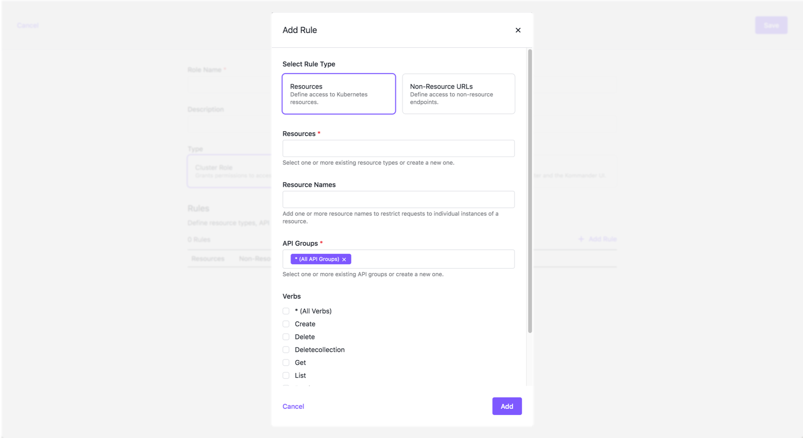
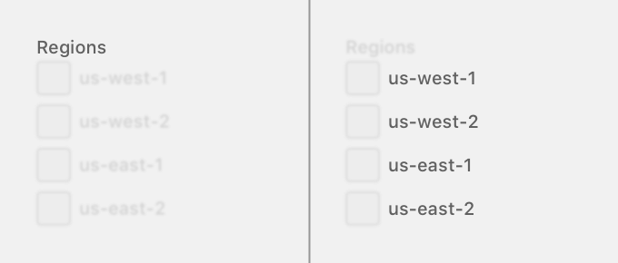

# Form Design Guidelines

A form may be used to collect data that is required to complete a task.

## Form contexts

The context in which a form is rendered depends on the complexity of the form and how critical the form's purpose is to the rest of the app.

### Full page

A form may be rendered on it's own page to help users to focus on completing their task with minimal distractions in the UI. Full page forms should have their own URL.

Render a form on it's own page if the form:

- is complex and has many fields
- will be used to complete an action that is very important

#### Example

### Section of a page

A form may be rendered on a page alongside additional content to avoid taking users out of their current flow. If the form is not always rendered to the page, it should have it's own URL. For example: `/route-to/my-page/` would become `route-to/my-page/edit`.

Render a form alongside other content if:

- the user may need to reference page content to help them fill out the form correctly
- the form is not so complex that it deserves it's own page
- it would be too disruptive to take a user away from the current page

### Dialog modal

A form may be rendered in a dialog modal to keep the user on their current page while directing their focus to a form. The first input of the form should receive focus when the modal is opened. Forms in dialog modals may have their own URL, but it's not required.

Render a form in a dialog modal if:

- there are very few fields in the form
- there is no logical place to render the form on the current page
- the user won't need to reference content that will be covered by the dialog

### Inline inputs

In lieu of rendering an entire form, a single input can be used in place of the data it controls. Inputs would replace the data once the user has explicity toggled edit mode.

Use an inline input if it would be too disruptive to show an entire form or take the user to a new page.

## Structure and hierarchy

Forms are designed with a consistent hierarchy and structure to make it easier for users to scan the inputs and submit their data.

Every form will have at least one section, but form sections should always be used when a complex form can be broken down into distinct sections of related fields.

For more information about the parts that make up a form, see the Storybook documentation for each component under the "Form structure" section.

### Field order

Order fields by their relative level of importance. The inputs that are most critical for the user to complete their task should come first.

### Field grouping

Fields that are closely related should be visually grouped together.

For more information on grouped fields, see the Storybook documentation for the `FieldList` and `FieldGroup` components.

### Form actions

A form should contain at least two buttons: one to submit the form, and one to navigate away from the form without submitting any of the input.

These buttons should be highly visible, and easy for the user to press.

### Multi-part forms

Forms should be kept as succinct as possible, but some forms require a lot of data input. Break complex forms into multiple forms when it will help the user focus on what data they're inputting.

#### Tabbed form pattern

Break a form into different tabs when its fields don't fit on one screen without overwhelming the user.

Keep in mind that breaking a form into separate tabs forces the user to navigate to find a specific field. Only use this pattern if tabbed sections make it easier to find a specific field.

#### Progressive disclosure pattern

If a complex form can be broken into a linear series of steps, sections can be progressively shown as the user inputs their data.

A progressive disclosure pattern is also useful when the value of one field will affect subsequent fields. For example: selecting a cloud provider before showing the fields for authorization credentials.

## Kinds of inputs

### Text inputs

Use text inputs when the field value is expected to be free-form text, and we can't provide a set of possible values for a user to choose from. For example: setting a cluster's display name.

For more detailed information on text inputs, see the Storybook documentation for the `TextInput` and `Textarea` components.

### Choice inputs

Use a choice input when a field has a known set of possible values. For example: selecting which version of Kubernetes should be used when creating a cluster.

Some examples of choice inputs include: typeahead dropdowns, `<select>` dropdowns, checkboxes, file upload fields, and segmented controls.

For more detailed information on choice inputs, see the respective Storybook documentation for the respective choice input components (e.g.: `CheckboxInput`, `SegmentedControl`, `SelectInput`, `ToggleBox`, etc)

## Field parts

A field can accept data in a variety of ways (e.g.: typing, dropdown selection, etc.), but they are generally made up of the same parts.

### Label

Labels are required to identify a corresponding input field. Label text should be descriptive, but as short as possible.

A label must be provided to maintain screenreader accessibility, but it may be visually hidden if there are other cues that identify what the field does. For example: a text input with a magnifying glass and placeholder text that says "Search".

Choice inputs such as checkboxes and segmented controls have a label for each option, but are also labeled as a collection.

### Required field indicator

When there is a collection of optional and required fields, the required fields should be clearly marked. This can help the user avoid submitting an invalid form because they left a required field blank.

### Label tooltip

Describes the purpose of the field and how it's value is used to help the user complete their task. This information will be hidden until the user opens the Tooltip, so do not put any information in here that is critical to task completion.

### Input

The input is the component that users interact with to set the value of the field.

### Placeholder text

When an input does not have a value set, placeholder text may be shown in it's place. Placeholder text is useful for hinting what data the input is expecting to receive. For example: showing "1" in the placeholder text for a field that is expecting a number.

Labels may not be replaced by placeholder text unless there are enough visual cues or context clues for the user to understand what the input does. Refer to the "Label" section above for information on labeling inputs.

### Hint content

Hint text can be used to caption an input with information that helps the user fill in the correct data. Hint text can also be used to display validation errors specific to the field.

Hint content and validation errors may be displayed at the same time as long as the information is not redundant. For example: hide the hint content if there is hint text that says "Enter a number", and the validation message says "This value must be a number".

Hint content should be kept as short as possible.

## Input states

See the [interactive component states guidelines](./interactive-element-states.md) for more infomation about the various states an input can be in.

## Submitting a form

Forms can be submitted using the "Enter" key, or a submit button.

The form's submit button should be highly visible, and clearly labeled to communicate what will happen when the button is pressed. For example: a button that uses form data to create a new object could have a label that says "Create", and a button that uses form data to update an existing object could have a label that says "Update" or "Save".

Forms that are broken into multiple parts (e.g.: tabbed forms, form with progressively disclosed fields) should only have one submit button that is visible no matter which set of fields is being displayed. For example: if a form's fields are broken up into multiple tabs, the user should have access to the "Submit" button no matter which tab is active.

Once a form is submitted, the submit button should be disabled until a success or error response is returned. While the form is waiting for a response, the submit button's label may be updated to indicate the form is being processed.

For highly complex configurations or forms that could have negative consequences if it's filled out incorrectly, the "Submit" action can be moved to a confirmation screen. The confirmation screen could show users a preview of the data they are about to submit and/or a warning about any undesired side-effects that may happen if the form is filled out incorrectly.

After a form is successfully submitted, users should be taken back whichever screen they opened the form from. If the content on that screen is affected by the form submission, the content should either be updated or have some indication that it is in the process of being updated.

## Validation

A form should not be validated until a user tries to submit it. If a form cannot be submitted, validation messages should be shown that tell the user was wrong and what they can do to fix it.

Validation messages can be displayed at different levels of specificity:

**Top level form validation:** If anything has prevented the form from being submitted, a message should be shown for the entire form notifying the user that there was a problem.

**Form tab level validation:** If a form's fields are broken up into tabs, users should be notified which tabs contain fields with an errors. In addition to the top level validation message, a validation message can optionally be shown in each tab.

**Field scope:** Invalid fields should be visually distinct from valid fields, and a validation message should be displayed as the field's hint content.

## Layout

Form layout is based on the [structure and hierarchy](#structure-and-hierarchy) of forms. Spacing and field placement are used to visually communicate relationships between individual fields and entire form sections.

## Accessibility

As long as ui-kit components are used to build forms and the guidelines above are followed, your form should be accessible to most users and whatever devices they're using to fill out the form.
