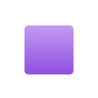
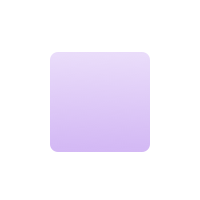
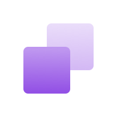

# UI Kit Icon Library

- [Naming Convention](#naming-convention)
  - [File Naming](#file-naming)
  - [Icon Shape IDs](#icon-shape-ids)
- [SVG Formatting Conventions](#icon-shape-ids)
- [System Icons](#system-icons)
  - [Visual Design Specifications](#system-icons-visual-design-specs)
  - [Icon Creation Tutorial](#system-icons-icon-creation-tutorial)
- [System Icons](#product-icons)
  - [Visual Design Specifications](#product-icons-visual-design-specs)
  - [Icon Creation Tutorial](#product-icons-icon-creation-tutorial)
- [Development](#development)
  - [How the Build Works](#how-the-build-works)
  - [Rendering Icons in an App That Depends on ui-kit](#rendering-icons-in-an-app-that-depends-on-ui-kit)
- [Troubleshooting](#troubleshooting)

## Naming Convention

Icon names should be short and descriptive. Each icon name must be unique.

System icon names should have generalized names for reusability purposes. For example, we have an icon named "Gear" (not "Settings" or "Admin") because the shape is a gear.

Product icon names can be more specific because they are attached to specific concepts and features in our apps.

### File Naming

File names should be all lowercase alphanumeric characters with words separated by hyphens. For example: `my-icon.svg`, not `myIcon.svg`.

File names are used to generate IDs when running the icon build script.

### Icon Shape IDs

Icon shape IDs are generated by the icon build script. When the icon build script generates enums for the icon IDs, it uses the SVG file names to set the key in PascalCase, and the value is the same as the file name. For example: the key-value pair for `my-icon.svg` becomes `MyIcon: 'my-icon'`.

## SVG Formatting Conventions

I recommend using Adobe Illustrator to create SVGs, but feel free to use whatever vector editing software you're most comfortable with.

In order to be rendered correctly, SVGs for system icons need to follow a few rules:

1. SVGs may not contain strokes, only fills. We color our icons using the `fill` property in CSS. If the SVG contains strokes, their color will not be changed.

2. System icons that have a "lighter" and a "darker" color should not use grey as the fill for the "lighter" color. Use black and set the the fill opacity to 30% (0.3). If grey was used, it would be the same color as the darker fill because we strip the SVG `fill` attribute so we can use CSS to change fill colors.

3. Do not use clipping masks. They can create inconsistent or buggy behavior in different browsers.

4. (Optional, but recommended) Make paths into compound paths. This reduces the chance of cross-browser rendering quirks and usually makes the file size smaller.

5. (Optional, but recommended) The SVG paths should be styled using SVG attributes. This means the SVG file should not contain any CSS or `style` attributes.
   - If you're exporting your SVG from Adobe Illustrator: open the "Advanced Options" menu, change the "CSS Properties" dropdown value to "Presentational Attributes" (screenshot)
   - If you're exporting your SVG from Sketch, you don't need to do anything

## System Icons

System icons are glyphs we can use as stand alone actions or to support labels in actions.

<span id="system-icons-visual-design-specs"></span>

### Visual Design Specifications

#### Grid

16px x 16px with at least 1px trim on all sides

#### Strokes

Stroke weight is 2px. Strokes must be converted to fills.

#### Color

System icons may have 1 or 2 fills. When using 2 fills, the first fill will be black at 100% fill opacity and the second fill will be black at 30% fill opacity. 2 fills are used to give the impression of depth.

<span id="system-icons-icon-creation-tutorial"></span>

### Icon Creation Tutorial

- Create a 16x16 artboard
- Draw your icon
- If you've used any strokes to draw your icon, convert them to outlines
- (optional, but recommended) Create 1 compound path for each fill color
- If your icon is using the light tone and the dark tone, make sure the light tone is being created using a fill opacity, _not_ a different fill color.
- Export the SVG and use a file name that conforms to the [naming conventions](#file-naming)

## Product Icons

Product icons are used to represent and convey the product suite features and capabilities (e.g. Universe, Network, Security, etc...). Unlike system icons, product icons are not meant to be paired with actions.

The primary purpose of product icons is way-finding, context, and messaging. Each product icon is unique in its own right, though all product icons share a consistent visual design style.

<span id="system-icons-visual-design-specs"></span>

### Visual Design Specifications:

#### Grid

24px x 24px with at least 1px trim on all sides

#### Color

There is always a lighter gradient and a darker gradient. These two gradients help to communicate depth as well as primary focus for the product icon. For example, a product icon for "Users" would likely be two user silhouettes layered one on top of the other. The silhouette in the foreground would be a dark gradient than the silhouette in the background – giving the impression of depth.

|                 Foreground                  |                 Background                  |                Combined                 |
| :-----------------------------------------: | :-----------------------------------------: | :-------------------------------------: |
|  |  |  |

Though not every icon will appear as a layering of shapes with obvious depth, there should always be two glyphs per product icon, each with a unique gradient as seen above. The example below shows an two example icons, one with obvious layering, and the other with that uses the gradient variation to communicate complexity.

|                 Users icon                  |                 Lock icon                 |
| :-----------------------------------------: | :---------------------------------------: |
|  |  |

When applying the gradient, the start color/opacity should begin at the top most point of the vector glyph and the stop color/opacity should end at the bottom most point. For compound shapes comprised of multiple closed paths, do not apply separate gradients to each. For example:

|                      Good                       |                      Bad                       |
| :---------------------------------------------: | :--------------------------------------------: |
|  |  |

Each product icon should have a colored variant for light backgrounds and a white variant for dark backgrounds. The gradients are always vertical with the lighter color on top and the darker color on the bottom. The easiest way to keep the gradients consistent in your new icon is to copy the gradient styles from an existing icon. You can also reference the values below:

Purple gradient (background):
Top: #7D58FF at 40% opacity
Bottom: #9779FF at 40% opacity

Purple gradient (foreground):
Top: #7D58FF at 100% opacity
Bottom: #9779FF at 100% opacity

White gradient (background):
Top: #FFFFFF at 60% opacity
Bottom: #FFFFFF at 40% opacity

White gradient (foreground):
Top: #FFFFFF at 80% opacity
Bottom: #FFFFFF at 100% opacity

<span id="product-icons-icon-creation-tutorial"></span>

### Icon Creation Tutorial

- Make sure document color mode is "RGB" (RGB is the default in Sketch, "CMYK" is the default in Illustrator)
- Create a 24x24 artboard
- Draw your icon
- If you've used any strokes to draw your icon, convert them to outlines
- (Optional, but recommended) Create 1 compound path for each fill color
- Fill both paths with color gradients
- Create a new file with a copy of the artboard and the colored icon
- In the new file, change the gradient fills to white
- Export each SVG and use a file name that conforms to the [Naming Conventions](#file-naming)

## Development

### How the Build Works:

- The build script loops through each icon in `packages/icons/src/icon-product/` and `packages/icons/src/icon-system/`, then runs a script (`packages/icons/scripts/illustratorSVGCleanup.js`) on each SVG file to move `<linearGradient>` definitions into `<defs>`.
  - `<linearGradient>` definitions need to be in `<defs>` so that gradient definitions are not duplicated when generating the SVG sprite.
- Then, the SVG sprites are generated using `svgstore`, and a unique ID is generated for each `<linearGradient>` definition.
  - SVGs in `packages/icons/src/icon-product/` go in one sprite, and `packages/icons/src/icon-product/` go in different sprite.
  - The sprites saved to `dist/packages/icons/dist/` are usable by apps that use ui-kit
  - The sprites saved to `packages/icons/dist/` are used for local development in Storybook
- Once the sprites are generated, they are optimized using `svgo`
  - Unnecessary whitespace, useless metadata, and useless attributes are removed.
  - The `fill` attribute is removed from system icon `<path>`s to ensure we can use CSS to change the fill color.
- Finally, enums are generated for system icon IDs and product icon IDs. These are used with the `Icon` component's `shape` prop to ensure we're only passing valid icon IDs.
  - The enums saved to `dist/packages/icons/dist/` are usable by apps that use ui-kit
  - The enums saved to `packages/icons/dist/` are used for local development in Storybook

### Rendering Icons in an App That Depends on ui-kit

Before any icons can be displayed in your app, the icon sprites need to be loaded into the DOM. In Kommander, we do this using [svg-inline-loader](https://www.npmjs.com/package/svg-inline-loader), and rendering the SVGs in a visually hidden div:

```
import productIconSprite from "!svg-inline-loader!@dcos/ui-kit/dist/packages/icons/dist/product-icons-sprite.svg";
import systemIconSprite from "!svg-inline-loader!@dcos/ui-kit/dist/packages/icons/dist/system-icons-sprite.svg";

...

<div
    style={{
        height: 0,
        opacity: 0,
        overflow: "hidden",
        visibility: "hidden",
        width: 0,
    }}
>
    <div
        dangerouslySetInnerHTML={{ __html: systemIconSprite }}
    />
    <div
        dangerouslySetInnerHTML={{ __html: productIconSprite }}
    />
</div>
```

Once your icon sprites are in the DOM, the `<Icon>` component may be used to render icons from the SVG sprite. Just pass the correct icon ID from the icon enums to the `shape` prop:

```
import { SystemIcons } from "@dcos/ui-kit/dist/packages/icons/dist/system-icons-enum";

<Icon shape={SystemIcons.ArrowRight} />
```

## Troubleshooting

#### I'm using the <Icon> component to render an icon in my app, but it is't showing

Make sure the icon sprites are being rendered to the DOM on every page of your app, and the sprites are not hidden using `display: none`.

#### I added a new icon, but it isn't showing in Storybook

Make sure you ran `npm run build:svg` after adding the new icon, then refresh the page. If that doesn't work, confirm that the:

#### The fill color on my icon is not changing

This is likely because:

- The SVG was drawn with strokes instead of fills
  - If this happens, the strokes need to be converted to paths
- The SVG fill color is set using `<style>` tags or a `style` attribute inside the SVG file that are not being overridden by styles from Emotion
  - If this happens, the SVG needs to be re-saved with its styles saved as attributes on the SVG elements. This is done automatically when using Sketch, but needs to be set manually when using Adobe Illustrator:
    - File > Save As...
    - Click the "Save" button and the "SVG Options" dialog will appear
    - Expand the advanced settings by clicking "More Options"
    - Change the value of "CSS Properties" to "Presentation Attributes"
- SVGO failed to strip the `fill` attribute when processing that SVG
  - If this happens, manually remove the `fill` attribute from the `<path>` or `<svg>` elements
